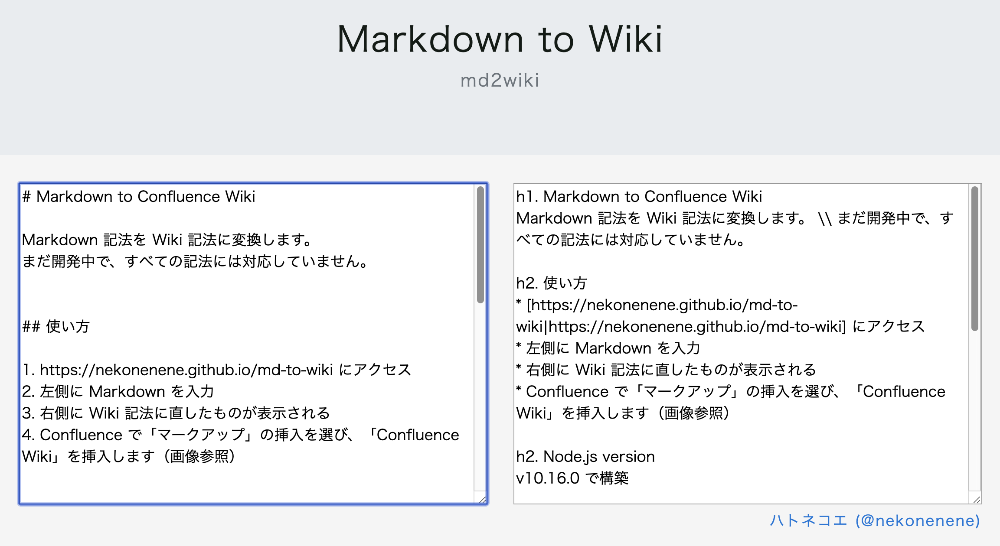
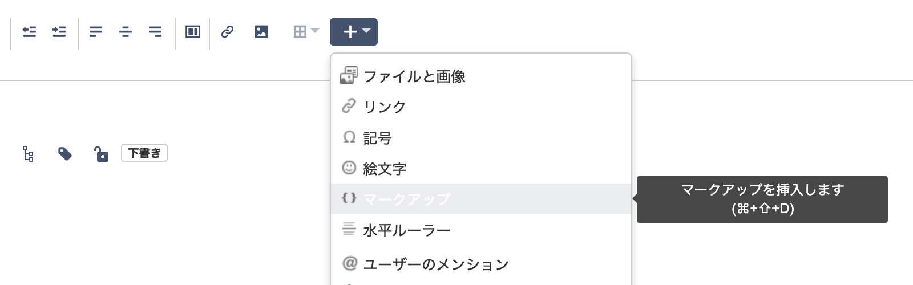
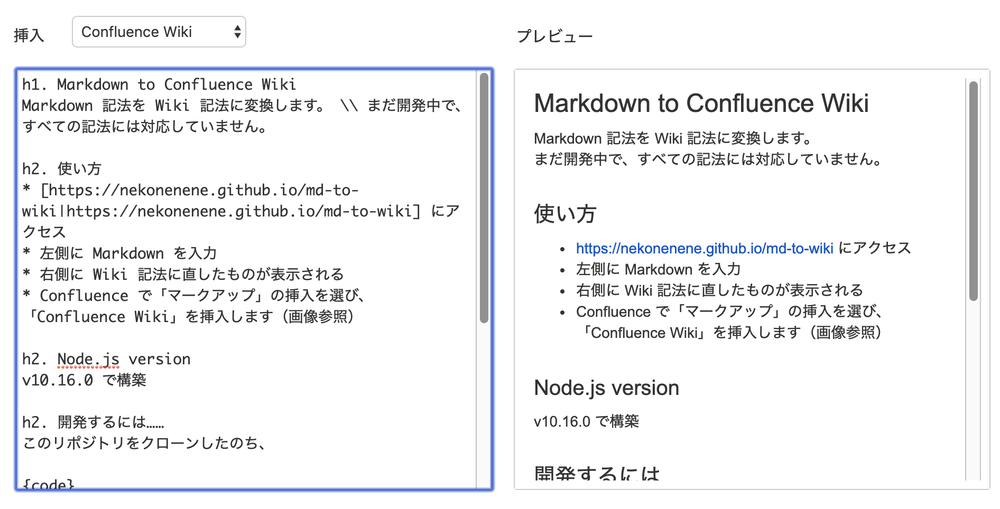

# Markdown to Confluence Wiki

Markdown 記法を Wiki 記法に変換します。  
まだ開発中で、すべての記法には対応していません。


## 使い方

1. https://nekonenene.github.io/md-to-wiki にアクセス
2. 左側に Markdown を入力
3. 右側に Wiki 記法に直したものが表示される
    <p align="center">
        
    </p>
4. Confluence で「マークアップ」の挿入を選び、「Confluence Wiki」を挿入します（画像参照）
    <p align="center">
        
    </p>
    <p align="center">
        
    </p>


## Node.js version

v10.16.0 で構築


## 開発するには……

このリポジトリをクローンしたのち、

```
npm install
```

で依存ライブラリのダウンロード。

```
npm run start
```

で開発用サーバーが起動し、 http://localhost:8013 にアクセス可能。
